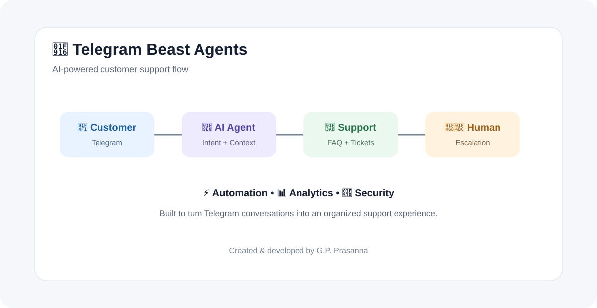
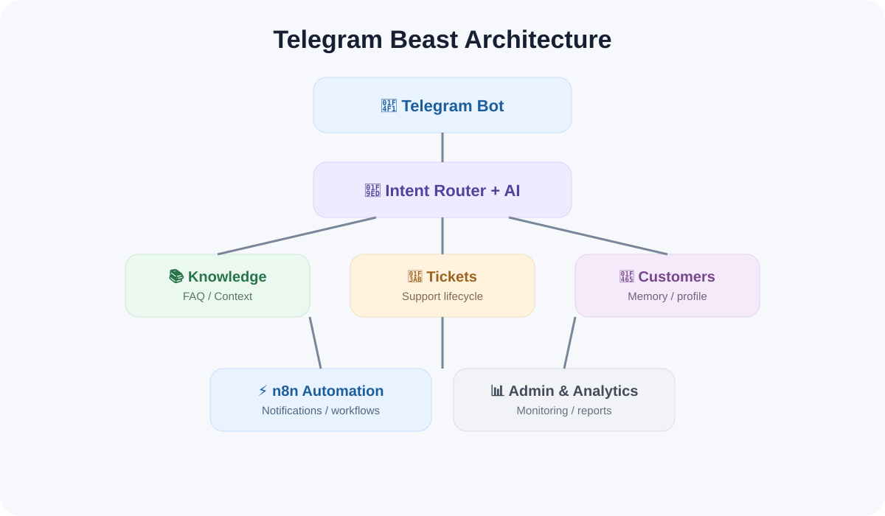

# 🤖 Telegram Beast Agents

> Professional Telegram-first AI Customer Service Platform

## ✨ Vision

Telegram Beast turns Telegram into a professional customer-service channel powered by AI, verified knowledge, ticketing, human escalation and automation.

## 🏗️ Architecture

Customer → Telegram → Intent Router → AI / Knowledge / Tickets → Human Support → n8n → Analytics

## 📁 Repository

- 🤖 bot/ — Telegram application
- 🧠 ai/ — AI agent and prompts
- 📚 knowledge/ — FAQ and knowledge base
- 🎫 tickets/ — ticketing domain
- 👥 customers/ — customer domain
- 👨‍💼 admin/ — admin tools
- ⚡ automation/ — n8n workflows
- 🔌 integrations/ — external adapters
- 🔐 security/ — security policies
- 📊 analytics/ — reporting
- 🧪 tests/ — tests
- 📖 docs/ — documentation
- 🎨 assets/ — demo visuals
- 🛠️ scripts/ — developer utilities

## 🚀 Planned features

💬 AI support • 📚 FAQ • 🎫 Tickets • 👨‍💼 Human escalation • ⭐ Feedback • 🔔 Notifications • ⚡ n8n automation • 📊 Analytics • 🔐 Security • 🌍 Multi-language • 📎 Media

## 🧭 Roadmap

- [x] Professional repository structure
- [x] Architecture and documentation
- [x] Safe configuration templates
- [x] Demo visuals
- [ ] Production Telegram bot
- [ ] Persistent customer database
- [ ] Ticket lifecycle
- [ ] Knowledge retrieval
- [ ] Human-agent inbox
- [ ] n8n automation pack
- [ ] Analytics dashboard
- [ ] Production deployment

## 🛡️ Security

Never commit Telegram tokens, API keys, passwords, cookies, databases or private customer data. Use .env locally and commit only .env.example.

## 📚 Docs

- docs/ARCHITECTURE.md
- docs/PROJECT_PLAN.md
- docs/TELEGRAM_FLOW.md
- docs/AI_SYSTEM_PROMPT.md
- automation/N8N.md
- security/SECURITY.md

Made with 🤖 + ⚡ + ❤️
